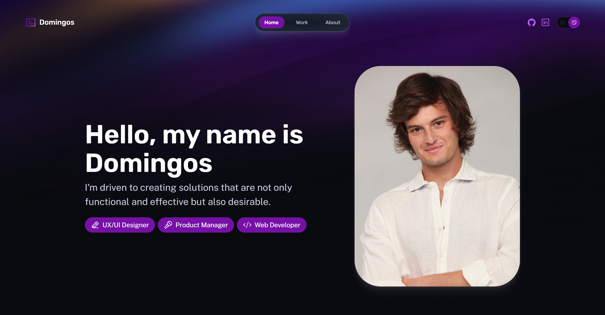

# Portfolio - Domingos Pinto-Coelho

## Description

This is the portfolio of Domingos Pinto-Coelho, showcasing his skills and experience in UX/UI Design and Product Management. The portfolio is built using Astro, a static site builder.

## Installation

To run this portfolio locally, follow these steps:

1. Clone the repository:
   `https://github.com/DomingosXPC/portfolio.git`

2. Navigate to the project directory:
   `portfolio`

3. Install the dependencies:
   `npm install`

## Usage

### Development Mode

To run the portfolio in development mode, use the following command:
`npm run dev`

This will start the Astro development server and you can access the portfolio in your browser at [http://localhost:3000](http://localhost:3000).

### Production Build

To build the portfolio for production, use the following command:
`npm run build`

This will generate the optimized static files in the `dist` directory.

### Preview Build

To preview the production build locally, use the following command:
`npm run preview`

This will start a local server to preview the built portfolio at [http://localhost:5000](http://localhost:5000).

## Profile Summary

Domingos Pinto-Coelho is a UX/UI Designer and Product Manager based in Cascais, Lisbon, Portugal. With over 4 years of experience, Domingos specializes in optimizing UX/UI on digital touchpoints, managing cross-functional teams, and aligning activation plans with marketing strategies.

## Experience

### Zasady

_Product Designer & Digital Marketeer_

- February 2021 - Present (2 years 5 months)
- Optimized UX/UI on all digital touchpoints
- Managed cross-functional teams
- Created end-to-end online UX/UI designs for web components with record-breaking conversion rates

### Nanos - AI Marketing

_UX/UI Designer_

- September 2019 - February 2021 (1 year 6 months)

## Education

- BrainStation
  - Product Management · May 2023 - August 2023
- NEOLAND
  - UX/UI · 2019
  - Web Development · 2019
- Udemy
  - UX/UI / Graphic Design / Web Development · 2019
- Teatro Experimental Cascais
  - Performative arts, Acting, Photography, Music · 2017 - 2019

## Top Skills

- UX/UI Design
- Product Management
- Web Development
- Search Engine Marketing (SEM)
- Data Analysis
- Customer Relationship Management (CRM)

## Languages

- English (Native or Bilingual)
- Spanish (Native or Bilingual)
- Portuguese (Native or Bilingual)
- French (Elementary)
